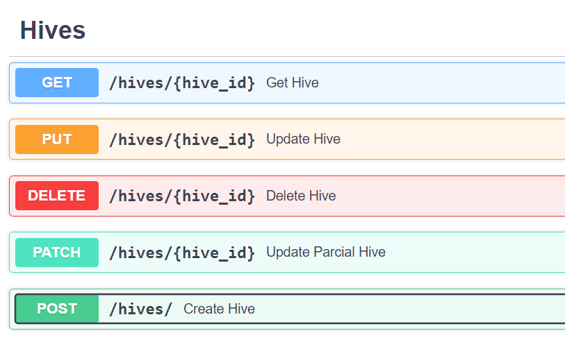
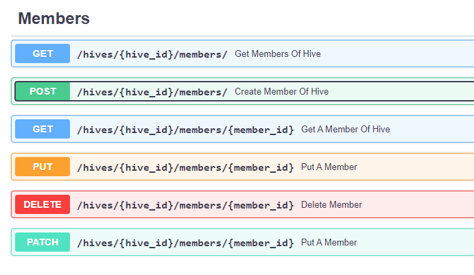
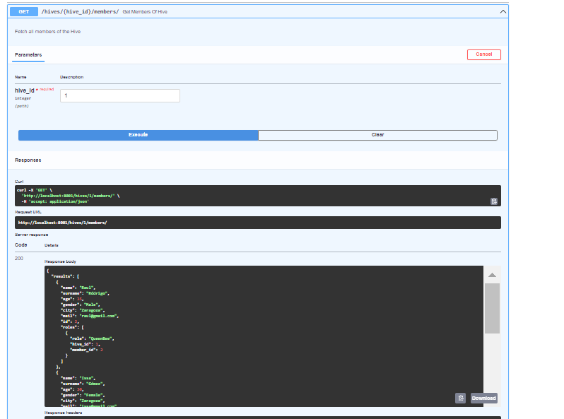
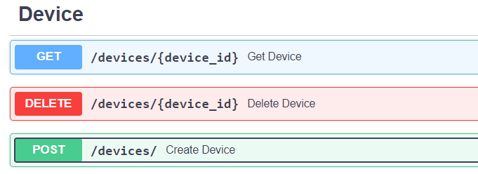
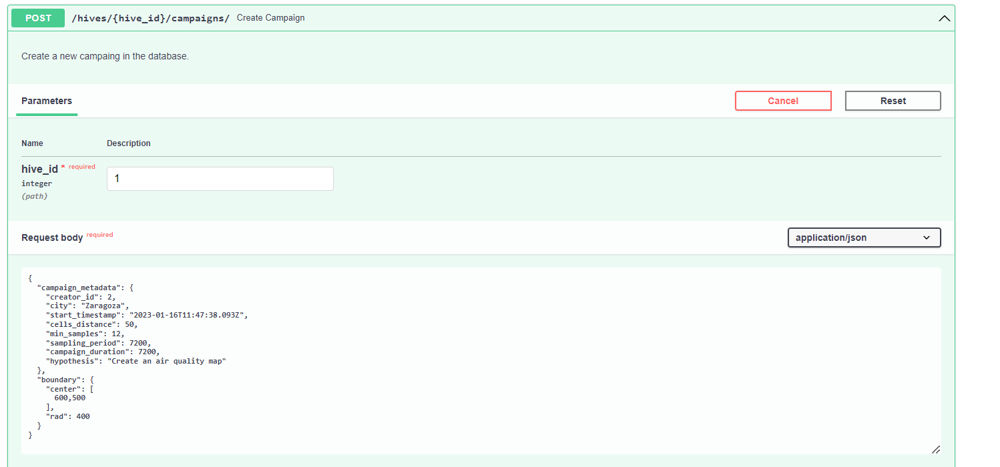

You have to follow these steps to be able to launch the Micro-Volunteering Engine (MVE): 
1. `pip install poetry` (or safer, follow the instructions: https://python-poetry.org/docs/#installation)
2. Install dependencies `cd` into the directory where the `pyproject.toml` is located then `poetry install`
3. [UNIX] Run `cd Model` 
4. [UNIX] Run `sudo mysql -uroot -p < BaseDatos.v6.sql`
5. [UNIX] Run `cd ..`
6. [UNIX]: Run the FastAPI server via poetry with the bash script: `poetry run ./run.sh`
6. [WINDOWS]: Run the FastAPI server via poetry with the Python command: `poetry run python src/Servicio/app/main.py`
7. Open http://localhost:8001/docs <!---!> 

The diagram below shows the process that has to be carried out within SOCIO-BEE to set-up a campaign in a pilot where air quality measurements will be gathered in a certain area and time period in order to deliver visualizations and indicators summarizing the air quality situation and evolution in a spatiotemporal manner. 

Use case - Example: 

1. **Create a Hive** At [http://localhost:8001](http://localhost:8001) in secction Hives at the endpoint post. 
    
    
    Click on Post endpoint and then in the "Try it out" button, complete the Request body (pìcture example) and click execute 
    
    
    We can see the newly created hive: 
    

2. **Create 1 QueenBee and 2 WorkingBee** At http://localhost:8001 in section Member at the endpoint post. 
    
    
    For each new member, we have to click on the POST endpoint and then, in the "Try it out" button, complete the hive_id with the ID of the previously created hive and complete the Request body in the case of QueenBee the role has to be QueenBee and for the both WorkerBee, WorkerBee. Click execute.
    
    
    Using the /hives/{hive_id}/members/ endpoint, we can see all the members of the hive. 
    
    
    NOTE: If we want to associate another role to a pre-created user, we have to use the POST endpoint at the role section using the id of the hive and the id of the user. 
3. **Define two devices:**  At [http://localhost:8001](http://localhost:8001) in secction   Devices at the endpoint post. 
    

     For each device, click on the POST endpoint and then in the "Try it out" button and complete the Request body (picture example) and click execute. 
    

    And we can see the created device: 
    
    
4. **Create a Campaign:** At http://localhost:8001 in secction Campaign at the endpoint post. 
    
    
    For example, if we want to create a short campaign to get air quality data for a small area. So, the strategy of this campaign is to collect as many measurements as possible for the campaign duration (which should not be long). Click on the POST endpoint and then in the "Try it out" button, and complete the Request body (picture example). The creator_id must be the id of a QueenBee of the hive.  
    

    We can visualize the campaign map with the /hives/{hive_id}/campaigns/{campaign_id}/show endpoint. In this case, the campaign has the following surface: 
    
5. **DEMO** If we want to visualize how the micro-volunteer engine works, you can execute the demo endpoint in the demo section. The result is allocated to the src/Servicio/app/Pictures/Measurements and src/Servicio/app/Pictures/Recommender folders. 
